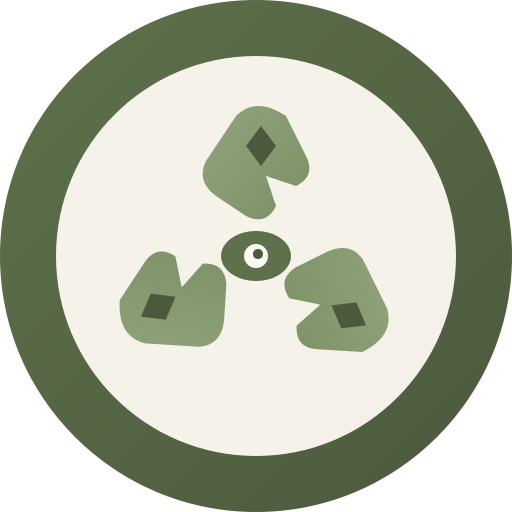

# 🌿 GreenVision - Smart Recycling Helper

<div align="center">
  
  
  **Snap a photo. Find recycling options. Save the planet.**
  
  A beautiful, mobile-first Progressive Web App that helps users identify recyclable items and find nearby drop-off locations.
</div>

---

## ✨ Features

- 📸 **Camera Integration** - Take photos directly or upload from gallery
- 📍 **Location-Aware** - Find recycling options specific to your city and state
- 💬 **Chat Interface** - Friendly, conversational UI for easy interaction
- 📱 **PWA Support** - Install on your phone like a native app
- 🎨 **Beautiful Design** - Sleek sage green, cream, and white color scheme
- ⚡ **Fast & Responsive** - Built with Next.js and optimized for mobile

## 🛠️ Tech Stack

- **Framework**: Next.js 14 (App Router)
- **Language**: TypeScript
- **Styling**: Tailwind CSS
- **Deployment**: Vercel
- **Backend**: n8n Webhook Integration

## 🚀 Getting Started

### Prerequisites

- Node.js 18+ installed
- npm or yarn package manager
- n8n webhook URL (for backend integration)

### Local Development

1. **Clone the repository**
   ```bash
   git clone <your-repo-url>
   cd greenvision
   ```

2. **Install dependencies**
   ```bash
   npm install
   ```

3. **Set up environment variables**
   ```bash
   cp .env.example .env.local
   ```
   
   Edit `.env.local` and add your n8n webhook URL:
   ```
   NEXT_PUBLIC_N8N_WEBHOOK_URL=https://your-subdomain.app.n8n.cloud/webhook/recyclingimage
   ```

4. **Run the development server**
   ```bash
   npm run dev
   ```

5. **Open in browser**
   
   Navigate to [http://localhost:3000](http://localhost:3000)

### Building for Production

```bash
npm run build
npm start
```

## 🌐 Deploy to Vercel

### Option 1: One-Click Deploy

[](https://vercel.com/new/clone?repository-url=YOUR_REPO_URL)

### Option 2: Manual Deployment

1. **Install Vercel CLI**
   ```bash
   npm i -g vercel
   ```

2. **Login to Vercel**
   ```bash
   vercel login
   ```

3. **Deploy**
   ```bash
   vercel
   ```
   
   For production:
   ```bash
   vercel --prod
   ```

### Option 3: GitHub Integration (Recommended)

1. **Push your code to GitHub**
   ```bash
   git init
   git add .
   git commit -m "Initial commit"
   git remote add origin <your-github-repo-url>
   git push -u origin main
   ```

2. **Connect to Vercel**
   - Go to [vercel.com](https://vercel.com)
   - Click "Add New Project"
   - Import your GitHub repository
   - Configure environment variables:
     - Name: `NEXT_PUBLIC_N8N_WEBHOOK_URL`
     - Value: Your n8n webhook URL
   - Click "Deploy"

3. **Your app will be live!**
   - Vercel will provide a URL like: `https://greenvision-xxxxx.vercel.app`
   - Every push to `main` will auto-deploy

## ⚙️ Environment Variables

| Variable | Description | Required |
|----------|-------------|----------|
| `NEXT_PUBLIC_N8N_WEBHOOK_URL` | Your n8n webhook endpoint URL | Yes |

### Setting Environment Variables in Vercel

1. Go to your project in Vercel Dashboard
2. Navigate to Settings → Environment Variables
3. Add your variables for Production, Preview, and Development

## 📱 PWA Installation

### iOS (Safari)
1. Open the app in Safari
2. Tap the Share button
3. Select "Add to Home Screen"

### Android (Chrome)
1. Open the app in Chrome
2. Tap the menu (3 dots)
3. Select "Add to Home screen" or "Install app"

## 🔧 n8n Webhook Configuration

Your n8n webhook should:

1. **Accept**: `POST` requests with `multipart/form-data`
2. **File field**: `image` (the uploaded photo)
3. **Query params**: `city` and `state`
4. **Return**: Plain text response (not JSON)

Example webhook URL structure:
```
POST https://your-subdomain.app.n8n.cloud/webhook/recyclingimage?city=Seattle&state=WA
```

## 📁 Project Structure

```
greenvision/
├── app/
│   ├── globals.css      # Global styles with Tailwind
│   ├── layout.tsx       # Root layout with PWA meta tags
│   └── page.tsx         # Main app page with logic
├── components/
│   ├── ChatPanel.tsx    # Chat message display
│   ├── Header.tsx       # App header with logo
│   └── ImagePicker.tsx  # Camera/file upload component
├── public/
│   ├── icon.svg         # App icon (SVG)
│   ├── icon-192.png     # PWA icon 192x192
│   ├── icon-512.png     # PWA icon 512x512
│   ├── apple-touch-icon.png  # iOS icon
│   └── manifest.webmanifest  # PWA manifest
├── .env.example         # Environment variables template
├── next.config.js       # Next.js configuration
├── tailwind.config.ts   # Tailwind CSS configuration
├── tsconfig.json        # TypeScript configuration
└── package.json         # Dependencies and scripts
```

## 🎨 Color Palette

| Color | Hex | Usage |
|-------|-----|-------|
| Sage 500 | `#7a8d62` | Primary accent |
| Sage 600 | `#5f714c` | Buttons, headers |
| Sage 700 | `#4b593d` | Dark accents |
| Forest | `#2d4a3e` | Text, deep accents |
| Cream 50 | `#fefdfb` | Backgrounds |
| Cream 100 | `#fdf9f3` | Card backgrounds |

## 📄 License

MIT License - feel free to use this for your own projects!

## 🤝 Contributing

Contributions are welcome! Please feel free to submit a Pull Request.

---

<div align="center">
  Made with 💚 for a greener planet
</div>
